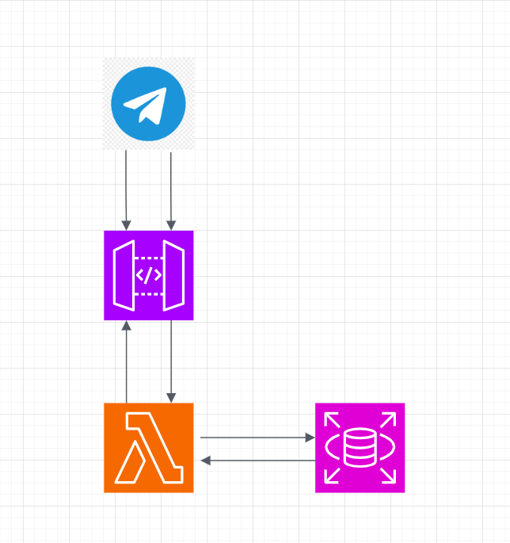

# MarketTwits Summarizer Lambda

An AWS Lambda function that automatically fetches financial market news from a Telegram channel, generates AI-powered summaries using OpenAI, and delivers them to subscribed users via a Telegram bot.

## Overview

This Lambda function serves as an automated news aggregation and summarization service for financial markets. It runs on a daily schedule (via EventBridge) to process the previous day's news from a Telegram channel, creates intelligent summaries, and distributes them to subscribed users. Additionally, it provides an interactive Telegram bot interface for user management.



## Features

### 🤖 Automated Daily Processing
- **Scheduled Execution**: Runs automatically via AWS EventBridge (cron) at 3:00 AM UTC
- **News Aggregation**: Fetches all messages from a specified Telegram channel for the previous day
- **AI Summarization**: Uses OpenAI GPT models to generate concise, structured summaries
- **Smart Filtering**: Focuses on important global market news while filtering out noise

### 💬 Interactive Telegram Bot
- **User Subscription Management**: Users can subscribe/unsubscribe via bot commands
- **On-Demand Summaries**: Users can request the latest summary at any time
- **Command Interface**: Simple, intuitive command-based interaction

### 📊 Data Persistence
- **Summary Storage**: All generated summaries are saved to a PostgreSQL database
- **User Management**: Subscribed user IDs are stored and managed in the database
- **History Access**: Users can retrieve past summaries on demand

## Architecture

The Lambda function is built with a modular architecture:

```
src/
├── models/          # Data models (NewsItem, Summary, etc.)
├── database/        # Database operations and connection management
├── bot/             # Telegram bot command handling
│   ├── parser.py    # Command parsing
│   ├── router.py    # Command routing
│   ├── commands.py  # Command handlers
│   └── messages.py  # Message templates
├── services/        # Business logic services
│   ├── telegram_client.py  # Telegram bot API client
│   ├── news_dumper.py      # Telegram channel message fetcher
│   ├── summarizer.py       # OpenAI summarization service
│   └── daily_job.py        # Daily job orchestration
└── config/          # Configuration management
```

## How It Works

### Daily Job Workflow

1. **EventBridge Trigger**: Lambda is invoked by EventBridge on a daily schedule
2. **News Fetching**: Connects to Telegram channel and fetches all messages from the previous day
3. **Summarization**: Sends aggregated news to OpenAI API for intelligent summarization
4. **Distribution**: Sends formatted summary to all subscribed users via Telegram bot
5. **Storage**: Saves the summary to database for historical access

### Bot Commands

The Lambda also handles webhook events from API Gateway for interactive bot commands:

- `/start` - Welcome message and bot introduction
- `/subscribe` - Subscribe to daily market summaries
- `/unsubscribe` - Unsubscribe from daily summaries
- `/get_latest` - Retrieve the most recent summary
- `/help` - Display available commands

## Configuration

### Required Environment Variables

```bash
# Telegram Configuration
TELEGRAM_API_ID=your_api_id
TELEGRAM_API_HASH=your_api_hash
TELEGRAM_SESSION_STRING=your_session_string
TELEGRAM_CHANNEL_USERNAME=MarketTwits  # Channel to monitor
TELEGRAM_BOT_TOKEN=your_bot_token      # Bot for sending messages

# OpenAI Configuration
OPENAI_API_KEY=your_openai_key
OPENAI_MODEL=gpt-3.5-turbo  # Optional, defaults to gpt-3.5-turbo

# Database Configuration
DB_HOST=your_db_host
DB_NAME=your_db_name
DB_USER=your_db_user
DB_PASSWORD=your_db_password
```

### Database Schema

The function requires two PostgreSQL tables:

**`chat_ids`** - Stores subscribed user IDs
```sql
CREATE TABLE chat_ids (
    chat_id BIGINT PRIMARY KEY
);
```

**`twits_summary`** - Stores generated summaries
```sql
CREATE TABLE twits_summary (
    timestamp TIMESTAMP NOT NULL,
    message TEXT NOT NULL
);
```

## Deployment

### Prerequisites

- AWS CLI configured
- Docker installed
- Access to AWS ECR
- PostgreSQL database

### Build and Deploy

1. **Build Docker Image**:
```bash
docker build -t daily-news-lambda:latest .
```

2. **Tag for ECR**:
```bash
docker tag daily-news-lambda:latest \
  <ACCOUNT_ID>.dkr.ecr.<REGION>.amazonaws.com/daily-news-lambda:latest
```

3. **Push to ECR**:
```bash
aws ecr get-login-password --region <REGION> | \
  docker login --username AWS --password-stdin \
  <ACCOUNT_ID>.dkr.ecr.<REGION>.amazonaws.com

docker push <ACCOUNT_ID>.dkr.ecr.<REGION>.amazonaws.com/daily-news-lambda:latest
```

4. **Configure Lambda**:
   - Set handler to `aws_lambda.lambda_handler`
   - Configure environment variables
   - Set up EventBridge rule for daily execution
   - Configure API Gateway endpoint for webhook

### Event Sources

The Lambda handles two types of events:

1. **EventBridge Events**: Triggered by cron schedule for daily job execution
2. **API Gateway Events**: Webhook requests from Telegram for bot commands

## Development

### Project Structure

- `aws_lambda.py` - Main Lambda handler and entry point
- `src/` - Modular source code organized by concern
- `Dockerfile` - Container definition for Lambda deployment
- `requirements.txt` - Python dependencies
- `aws_test.py` - Local testing utilities

### Local Testing

Use `aws_test.py` to test webhook events locally:

```python
from aws_lambda import lambda_handler

# Test webhook event
event = {
    "httpMethod": "POST",
    "body": json.dumps({
        "message": {
            "chat": {"id": 123456789},
            "text": "/start"
        }
    })
}

result = lambda_handler(event, {})
```

## Dependencies

- `python-telegram-bot` - Telegram bot API client
- `telethon` - Telegram client library for channel access
- `openai` - OpenAI API client for summarization
- `psycopg2-binary` - PostgreSQL database adapter
- `python-dotenv` - Environment variable management

## License

See [LICENSE](LICENSE) file for details.

## Contributing

This is a private project. For issues or questions, please contact the maintainer.

